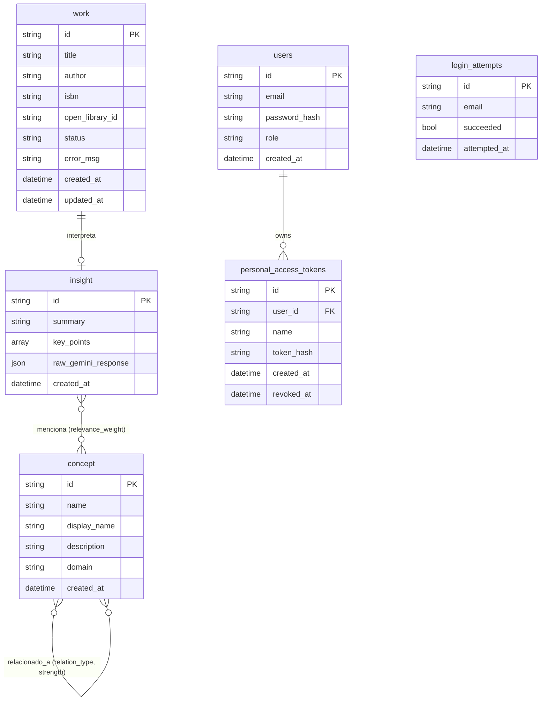

# Architecture Document: Knowledge Vault

**Version:** 1.0
**Date:** 2026-04-20
**Architect Agent:** BMAD Pipeline — Phase 3
**Input:** `_bmad/docs/prd.md` v1.1 (PRD, 24 FRs · 16 NFRs · 8 Epics · 21 Stories)
**Issue:** REN-100

---

## 1. Tech Stack Selection

### Backend

| Component | Choice | Version | Justification |
|-----------|--------|---------|---------------|
| Language | Rust | 1.78+ (stable) | Required by spec. Zero-cost abstractions, musl cross-compilation, memory safety without GC, deterministic binary size. |
| HTTP framework | Axum | 0.8+ | Required by spec. Tower-compatible, native `tokio` integration, first-class WebSocket via `axum::extract::ws`. Alternative (Actix-web) uses its own runtime — adds friction with Leptos + NATS. |
| Async runtime | Tokio | 1.x | Default for Axum and async-nats. Full-featured, stable on musl targets. |
| TLS | rustls | 0.23+ | Pure-Rust TLS, musl-safe. Alternative (OpenSSL) requires linking against system libs, breaking the musl single-binary goal. |

**Known trade-off:** Rust's compile times are slow. Accept this — the deployment target is a binary artifact, not a hot-reload dev loop.

### Frontend

| Component | Choice | Version | Justification |
|-----------|--------|---------|---------------|
| Framework | Leptos | 0.7+ | Required by spec. SSR + WASM isomorphic rendering; full Rust stack avoids JS toolchain in CI. Alternative (Dioxus) has weaker SSR story in 2026. |
| Build tool | cargo-leptos | latest | Official Leptos build tool; handles WASM compilation, asset bundling, and dev server. |
| Styling | Plain CSS (embedded) | — | BMW design system is a small, fixed set of design tokens. A CSS framework (Tailwind) adds build complexity with no benefit for a single-developer app. |
| Graph rendering | Cytoscape.js (via JS interop) | 3.x | See OQ-01 resolution below. Accessed from WASM via `wasm-bindgen` + `js-sys`. |

**OQ-01 Resolution — Graph rendering library:**
- **Decision:** Cytoscape.js via `wasm-bindgen` JS interop.
- **Rationale:** FR-31–FR-36 require interactive zoom/pan/drag, edge thickness by weight, hover labels, domain filtering, and click-to-navigate. Building a compliant layout engine in pure Rust (force-directed or hierarchical) is 6–8 weeks of work with no user-visible advantage. Cytoscape.js is battle-tested for exactly this use case.
- **Constraint (owner):** Node shape = rectangular (0px border-radius, `shape: 'rectangle'` in Cytoscape style). Edge routing = orthogonal (`curve-style: 'taxi'`). BMW Blue (`#1c69d4`) for node borders on selected state. This is expressible through Cytoscape's stylesheet API.
- **Alternative considered:** petgraph + custom SVG — rejected because it would require implementing a graph layout algorithm (Fruchterman-Reingold or Sugiyama) plus edge routing from scratch.

### Database

| Component | Choice | Version | Justification |
|-----------|--------|---------|---------------|
| Engine | SurrealDB (SurrealKV storage) | 3.0 | Required by spec. Embedded graph database; native edge semantics eliminate a separate graph layer; schema-enforced via `SCHEMAFULL`. |
| Client | `surrealdb` crate | 2.x | Official Rust SDK; supports embedded `Surreal::<SurrealKV>`. |
| Migration tool | Hand-crafted SurrealQL startup script | — | SurrealDB 3.0 has no official migration tooling comparable to sqlx-migrate. The schema is small (5 tables, 3 edge types); startup `DEFINE IF NOT EXISTS` statements cover all cases. |

**GraphWriteRepo Port**

The `GraphWriteRepo` is a core `port` trait (interface) that defines the atomic graph persistence operation within the Knowledge Vault. Its primary responsibility is to ensure the all-or-nothing semantics of writing the complex graph structure associated with a processed work.

The `GraphWriteRepo::write_graph_transaction` method orchestrates the following:
- **Insight Node Creation:** Persists the extracted summary, key points, and raw Gemini response.
- **`interpreta` Edge Creation:** Links the `work` to its `insight`.
- **Concept Upserts:** Creates new concept nodes or reuses existing ones based on normalized names, preventing duplicates.
- **`menciona` Edges Creation:** Connects the `insight` to all relevant `concept` nodes.
- **`relacionado_a` Edges Creation:** Establishes relationships between related `concept` nodes as identified by Gemini.
- **Work Status Update:** Transitions the `work` status to `'done'` upon successful completion.

Crucially, this entire sequence is executed within a single `BEGIN TRANSACTION` / `COMMIT` block in SurrealQL, leveraging SurrealDB's ACID properties to guarantee that either all graph elements are successfully written, or none are. This prevents the database from entering an inconsistent state due to partial failures during the complex graph population process.

**OQ-02 Resolution — Transaction semantics:**
- **Decision:** Use `BEGIN TRANSACTION` / `COMMIT` in SurrealQL 3.0 for the atomic graph write sequence (FR-25).
- **Rationale:** SurrealKV supports ACID transactions with `BEGIN TRANSACTION`. Individual statement atomicity is NOT sufficient for FR-25, which requires the entire sequence (concept upsert → menciona edge → relacionado_a edges → insight creation → interpreta edge → work status update) to succeed or roll back atomically (FR-25, US-13).
- **Known trade-off:** SurrealDB 3.0 SurrealKV transaction isolation level must be validated during integration testing. Treat as highest-risk DB assumption; write a targeted integration test before implementing the worker pipeline.


### Messaging

| Component | Choice | Justification |
|-----------|--------|---------------|
| Message broker | NATS JetStream | Required by spec (FR-10, FR-12). JetStream provides durable consumer, explicit ack/nack, and delivery count — all required by the retry policy (FR-14, FR-15). |
| NATS server strategy | Self-extracting binary (std::process) | See OQ-03 resolution. |
| Client | async-nats | 0.37+ | Official async Rust client; JetStream support stable. |

**OQ-03 Resolution — NATS embedded server:**
- **Decision:** Self-Extracting Binary strategy. The NATS server binary (compiled for `aarch64-unknown-linux-musl`) is embedded in the Rust binary as a byte slice via `include_bytes!`. At startup, the binary is extracted to a temp path (`/tmp/knowledge-vault-nats-<pid>`), made executable, and spawned as a child process via `std::process::Command`. The Rust process owns the child; on exit/signal, the child is killed and the temp file removed.
- **Rationale:** `async-nats` is a client-only library — there is no `server` feature. There is no stable embedded pure-Rust NATS server as of 2026. The self-extracting approach preserves the single-binary user experience (one file to deploy) while using the official, battle-tested NATS server.
- **Binary size impact:** The NATS server stripped musl binary is ~20–25 MB. Combined with the Rust binary (~30–35 MB), the total single file approaches ~55 MB stripped — within NFR-03 (< 60 MB).
- **NATS config:** Minimal config generated at runtime: JetStream enabled, storage dir in `$DATA_DIR/nats`, port on `127.0.0.1:4222`. No auth required — NATS is only reachable from localhost.
- **Alternative considered:** Pure-Rust NATS server — does not exist in a production-ready form.

### AI / LLM

| Component | Choice | Justification |
|-----------|--------|---------------|
| Provider | Gemini 3 Flash Preview (primary) | Owner decision. Better concept extraction than earlier Flash models. `response_schema` constrained generation (FR-19) reduces hallucination in structured fields. |
| Client | `reqwest` (plain HTTP) | Gemini REST API. No official Rust Gemini SDK with `response_schema` support exists; hand-rolling the HTTP call against `generativelanguage.googleapis.com` is < 50 lines. |
| Fallback strategy | Code-level field defaulting for optional fields | Owner decision. If Gemini omits optional fields (e.g., `related_concepts[].strength`), the code fills safe defaults (0.5 for strength, `"related"` for relation_type). Schema violations on required fields (`name`, `description`, `domain`) treat the response as a permanent failure (US-11 AC). |

### Infrastructure

| Component | Choice | Justification |
|-----------|--------|---------------|
| Cloud | Oracle Cloud ARM64 Free Tier | Required by NFR-02 (Felipe's use case). VM.Standard.A1.Flex: 4 vCPU, 24 GB RAM — generous for this workload. |
| Compute target | `aarch64-unknown-linux-musl` | Required by NFR-02. musl enables fully static binary, no glibc dependency. |
| Cross-compilation | `cross` (Docker-based) | Manages musl toolchain and OpenSSL (replaced by rustls) without host setup. |
| Reverse proxy | caddy or nginx (user-managed) | Out of scope for this binary. The binary binds to port 8080; TLS termination is the operator's responsibility. |
| Data persistence | Local filesystem (`$DATA_DIR`) | SurrealKV data directory configured via env. No object storage, no managed DB. |

### CI/CD

| Component | Choice | Justification |
|-----------|--------|---------------|
| Pipeline | GitHub Actions | Standard; `cross` action handles musl cross-compilation. |
| Deployment | Direct binary replacement + systemd restart | MVP simplicity. Blue-green deploy requires two instances — overkill for a single-user tool on a free-tier VM. |
| Artifact | Single stripped binary uploaded to GitHub Releases | Matches NFR-01, NFR-02. User downloads, scp to VM, systemd starts. |

### Third-party Services

| Service | SDK/Approach | Scope |
|---------|-------------|-------|
| Open Library API | `reqwest` (plain HTTP, no API key) | Book metadata enrichment (FR-13). Rate limit: 1 req/s safe practice. |
| Gemini API | `reqwest` (REST, API key in env) | Concept extraction (FR-19–FR-22). Timeout: 15s (NFR-07). |

---

## 2. System Architecture

### Component Diagram

```
┌─────────────────────────────────────────────────────────────────────────┐
│                    knowledge-vault binary (aarch64-musl)                │
│                                                                          │
│  ┌──────────────┐   spawn    ┌──────────────────────────────────────┐   │
│  │ NATS Server  │◄──────────│        Startup Orchestrator           │   │
│  │ (embedded    │           │  • extract nats-server binary         │   │
│  │  subprocess) │           │  • run DB schema migrations           │   │
│  └──────┬───────┘           │  • bind HTTP + WebSocket              │   │
│         │ 127.0.0.1:4222    └──────────────────────────────────────┘   │
│         │                                                                │
│  ┌──────▼──────────────────────────────────────────────┐               │
│  │                  Axum HTTP Server (:8080)            │               │
│  │                                                      │               │
│  │  ┌─────────────┐  ┌──────────────┐  ┌───────────┐  │               │
│  │  │ Auth        │  │ API Handlers │  │ WebSocket │  │               │
│  │  │ Middleware  │  │ /api/*       │  │ /ws       │  │               │
│  │  └─────────────┘  └──────────────┘  └───────────┘  │               │
│  │  ┌──────────────────────────────────────────────┐   │               │
│  │  │         Leptos SSR Handler (/ui routes)      │   │               │
│  │  └──────────────────────────────────────────────┘   │               │
│  └──────┬──────────────────────────────────┬───────────┘               │
│         │                                  │                            │
│  ┌──────▼────────────┐           ┌─────────▼──────────────────────┐   │
│  │  Domain / App     │           │  Infrastructure Adapters        │   │
│  │  Services         │           │                                  │   │
│  │  • DiscoverySvc   ├──────────►│  • SurrealDB (SurrealKV)        │   │
│  │  • WorkerSvc      │           │  • NATS Publisher/Consumer      │   │
│  │  • AuthSvc        │           │  • OpenLibrary HTTP client      │   │
│  │  • GraphSvc       │           │  • Gemini HTTP client           │   │
│  └───────────────────┘           └────────────────────────────────┘   │
└─────────────────────────────────────────────────────────────────────────┘
                          │ HTTPS (user-managed TLS)
                          ▼
                     Browser (WASM hydration)
                     Cytoscape.js (graph render)
```

### Service Boundaries

The application is a **modular monolith**. Rationale: NFR-01 (single binary), NFR-16 (single-user, 100 books max). Microservices would require IPC serialization and add deployment complexity with zero benefit for this scale.

Internal module boundaries map to hexagonal architecture:
- `domain/` — pure Rust structs, enums, business rules. Zero I/O.
- `ports/` — async traits defining the interfaces domain services call.
- `adapters/` — concrete implementations of ports (SurrealDB, NATS, etc.).
- `app/` — application services wiring domain logic to ports.
- `web/` — Axum HTTP layer (routes, middleware, handlers).
- `ui/` — Leptos components (SSR-rendered, WASM-hydrated).

### Data Flow: Critical User Journeys

**Journey 1 — Book Submission to Graph Population**
```
User POST /api/works (ISBN)
  → Auth middleware validates JWT/PAT
  → WorksHandler deduplication check (SurrealDB SELECT WHERE isbn = ?)
  → Create work{status: pending} in SurrealDB
  → Publish discovery.requested{work_id} to NATS JetStream
  → Return 202 {work_id}

NATS Worker (background task):
  → Consume discovery.requested
  → Update work{status: processing}
  → Publish discovery.status{work_id, status: processing} → WebSocket broadcast
  → Fetch book metadata: OpenLibrary API
  → Build Gemini prompt (title + author + description + subjects)
  → POST to Gemini API with response_schema
  → Parse structured JSON response
  → BEGIN TRANSACTION (SurrealDB)
      → UPSERT concept nodes (normalized name dedup)
      → CREATE insight node
      → RELATE work → interpreta → insight
      → RELATE insight → menciona → concepts
      → RELATE concept → relacionado_a → concept (for each related_concepts entry)
      → UPDATE work SET status = 'done'
  → COMMIT
  → Publish discovery.status{work_id, status: done} → WebSocket broadcast
  → ACK NATS message
```

**Journey 2 — Concept Graph Page Load**
```
Browser GET /graph
  → Leptos SSR renders page shell + loading state
  → WASM hydrates in browser
  → Leptos fetch GET /api/graph
  → API handler: SELECT * FROM concept FETCH ->relacionado_a->concept
  → Return {nodes: [...], edges: [...]}
  → WASM passes data to Cytoscape.js via JS interop
  → Cytoscape renders with orthogonal edges, rectangular nodes, domain colors
  → User clicks node → navigate to /graph/concepts/{id} (or inline panel)
```

**Journey 3 — Real-time Status Updates via WebSocket**
```
Browser connects GET /ws (after login)
  → Axum WebSocket upgrade, stores sender in WsBroadcaster (Arc<Mutex<HashMap<SessionId, Sender>>>)
  → NATS Worker publishes discovery.status events
  → WorkerSvc reads event, calls WsBroadcaster::broadcast(work_id, status)
  → WebSocket frame pushed to all connected clients
  → Leptos reactive signal updated: status badge re-renders without page reload (FR-28)
```

### Transactional Graph Write Flow

To ensure data consistency and atomicity for graph persistence (FR-25), the worker pipeline encapsulates the entire sequence of concept upserts, edge creations, and work status updates within a single SurrealDB transaction. This atomic operation guarantees that either all changes are successfully committed, or if any step fails, the entire transaction is rolled back, preventing partial or inconsistent states in the knowledge graph.

The sequence of operations performed within this transaction is as follows:

1.  **CREATE `insight` Node:** The `insight` node, containing the summary, key points, and raw Gemini response, is persisted.
2.  **CREATE `interpreta` Edge:** A relationship is created linking the `work` node to its corresponding `insight` node.
3.  **UPSERT Concept Nodes:** Normalized concept nodes are created or updated, preventing duplicates based on their `name`.
4.  **CREATE `menciona` Edges:** Relationships are established between the `insight` node and the `concept` nodes extracted from the book.
5.  **CREATE `relacionado_a` Edges:** Connections between related `concept` nodes are established based on Gemini's output.
6.  **UPDATE `work` Status:** The `work` record's status is updated to `'done'`, signifying successful processing.

This entire block is executed within a `BEGIN TRANSACTION` and `COMMIT` statement in SurrealQL, ensuring atomicity (US-13) and preventing partial graph states. In the event of a failure at any point within this sequence, the transaction is automatically rolled back by SurrealDB, maintaining data integrity.


### Deployment Topology

Single binary on a single VM. No load balancer, no container orchestration. Justified by NFR-16 (single user, 100 books).

```
Oracle Cloud ARM64 VM
├── /usr/local/bin/knowledge-vault  (the binary)
├── /etc/knowledge-vault/config.toml  (env overrides)
├── /var/lib/knowledge-vault/  (DATA_DIR)
│   ├── knowledge_vault.surrealkv/  (SurrealDB storage)
│   └── nats/  (JetStream storage)
└── systemd: knowledge-vault.service
```

---

## 3. Data Model

### Core Entities and Relationships

```
┌─────────────────┐         ┌──────────────────┐         ┌───────────────────┐
│      work        │         │     insight       │         │     concept        │
├─────────────────┤         ├──────────────────┤         ├───────────────────┤
│ id              │         │ id               │         │ id                │
│ title           │         │ summary          │         │ name (normalized) │
│ author          │         │ key_points[]     │         │ display_name      │
│ isbn            │         │ raw_gemini_json  │         │ description       │
│ open_library_id │         │ created_at       │         │ domain            │
│ status          │         └──────────────────┘         │ created_at        │
│ error_msg       │                                       └───────────────────┘
│ created_at      │
│ updated_at      │
└─────────────────┘

Edges (SurrealDB graph relations):
  work    --[interpreta]-->  insight   (1:1 per work after processing)
  insight --[menciona]-->    concept   (1:many, relevance_weight on edge)
  concept --[relacionado_a]--> concept (many:many, relation_type + strength on edge)

Auth tables (relational, not graph):
  users: id, email, password_hash, role, created_at
  personal_access_tokens: id, user_id, name, token_hash, created_at, revoked_at
  login_attempts: id, email, attempted_at, succeeded
```

### ERD



### SurrealQL Schema

```surrealql
-- Auth tables (SCHEMAFULL)
DEFINE TABLE IF NOT EXISTS users SCHEMAFULL;
DEFINE FIELD IF NOT EXISTS id          ON users TYPE string;
DEFINE FIELD IF NOT EXISTS email       ON users TYPE string ASSERT string::is::email($value);
DEFINE FIELD IF NOT EXISTS password_hash ON users TYPE string;
DEFINE FIELD IF NOT EXISTS role        ON users TYPE string DEFAULT 'admin';
DEFINE FIELD IF NOT EXISTS created_at  ON users TYPE datetime DEFAULT time::now();
DEFINE INDEX IF NOT EXISTS users_email ON users COLUMNS email UNIQUE;

DEFINE TABLE IF NOT EXISTS personal_access_tokens SCHEMAFULL;
DEFINE FIELD IF NOT EXISTS id          ON personal_access_tokens TYPE string;
DEFINE FIELD IF NOT EXISTS user_id     ON personal_access_tokens TYPE record<users>;
DEFINE FIELD IF NOT EXISTS name        ON personal_access_tokens TYPE string;
DEFINE FIELD IF NOT EXISTS token_hash  ON personal_access_tokens TYPE string;
DEFINE FIELD IF NOT EXISTS created_at  ON personal_access_tokens TYPE datetime DEFAULT time::now();
DEFINE FIELD IF NOT EXISTS revoked_at  ON personal_access_tokens TYPE option<datetime>;

DEFINE TABLE IF NOT EXISTS login_attempts SCHEMAFULL;
DEFINE FIELD IF NOT EXISTS id          ON login_attempts TYPE string;
DEFINE FIELD IF NOT EXISTS email       ON login_attempts TYPE string;
DEFINE FIELD IF NOT EXISTS succeeded   ON login_attempts TYPE bool;
DEFINE FIELD IF NOT EXISTS attempted_at ON login_attempts TYPE datetime DEFAULT time::now();
DEFINE INDEX IF NOT EXISTS login_attempts_email_time ON login_attempts COLUMNS email, attempted_at;

-- Domain tables (SCHEMAFULL)
DEFINE TABLE IF NOT EXISTS work SCHEMAFULL;
DEFINE FIELD IF NOT EXISTS id              ON work TYPE string;
DEFINE FIELD IF NOT EXISTS title           ON work TYPE string;
DEFINE FIELD IF NOT EXISTS author          ON work TYPE string;
DEFINE FIELD IF NOT EXISTS isbn            ON work TYPE option<string>;
DEFINE FIELD IF NOT EXISTS open_library_id ON work TYPE option<string>;
DEFINE FIELD IF NOT EXISTS status          ON work TYPE string; -- pending|processing|done|failed
DEFINE FIELD IF NOT EXISTS error_msg       ON work TYPE option<string>;
DEFINE FIELD IF NOT EXISTS created_at      ON work TYPE datetime DEFAULT time::now();
DEFINE FIELD IF NOT EXISTS updated_at      ON work TYPE datetime DEFAULT time::now();
DEFINE INDEX IF NOT EXISTS work_isbn    ON work COLUMNS isbn UNIQUE;
DEFINE INDEX IF NOT EXISTS work_ol_id   ON work COLUMNS open_library_id UNIQUE;

DEFINE TABLE IF NOT EXISTS insight SCHEMAFULL;
DEFINE FIELD IF NOT EXISTS id                  ON insight TYPE string;
DEFINE FIELD IF NOT EXISTS summary             ON insight TYPE string;
DEFINE FIELD IF NOT EXISTS key_points          ON insight TYPE array<string>;
DEFINE FIELD IF NOT EXISTS raw_gemini_response ON insight TYPE string; -- stored as JSON string
DEFINE FIELD IF NOT EXISTS created_at          ON insight TYPE datetime DEFAULT time::now();

DEFINE TABLE IF NOT EXISTS concept SCHEMAFULL;
DEFINE FIELD IF NOT EXISTS id           ON concept TYPE string;
DEFINE FIELD IF NOT EXISTS name         ON concept TYPE string;  -- normalized (lowercase, trimmed)
DEFINE FIELD IF NOT EXISTS display_name ON concept TYPE string;  -- original casing from Gemini
DEFINE FIELD IF NOT EXISTS description  ON concept TYPE string;
DEFINE FIELD IF NOT EXISTS domain       ON concept TYPE string;  -- free-form (OQ-06 resolved)
DEFINE FIELD IF NOT EXISTS created_at   ON concept TYPE datetime DEFAULT time::now();
DEFINE INDEX IF NOT EXISTS concept_name ON concept COLUMNS name UNIQUE;

-- Edge tables
DEFINE TABLE IF NOT EXISTS interpreta SCHEMAFULL TYPE RELATION IN work OUT insight;

DEFINE TABLE IF NOT EXISTS menciona SCHEMAFULL TYPE RELATION IN insight OUT concept;
DEFINE FIELD IF NOT EXISTS relevance_weight ON menciona TYPE float;

DEFINE TABLE IF NOT EXISTS relacionado_a SCHEMAFULL TYPE RELATION IN concept OUT concept;
DEFINE FIELD IF NOT EXISTS relation_type ON relacionado_a TYPE string; -- enables|contrasts_with|is_part_of|extends|related
DEFINE FIELD IF NOT EXISTS strength      ON relacionado_a TYPE float;
```

### DB Conventions
- IDs: UUID v4 generated in Rust, stored as strings. SurrealDB record IDs use format `table:uuid`.
- Timestamps: `datetime` in SurrealDB (RFC 3339 UTC).
- Soft deletes: Not used in v1 — works and tokens are hard-deleted if needed.
- Concept deduplication: `name` field stores lowercase-trimmed version; `display_name` stores the Gemini-returned casing. Upsert uses `IF NOT EXISTS` pattern: insert concept only if name not found.

---

## 4. API Design

### Style and Versioning
- REST, JSON bodies, `Content-Type: application/json`.
- No versioning prefix for v1 (`/api/...`). Version header (`X-API-Version`) reserved for future use.
- All API responses use a consistent envelope only for errors. Success responses return the resource directly.

### Authentication and Authorization
- JWT (HS256, 24h expiry): passed as `Authorization: Bearer <token>` or `Cookie: session=<token>`.
- PAT (`ens_<32-char-random>`): passed as `Authorization: Bearer ens_...`. Server validates by hashing with Argon2id and comparing to stored hashes.
- Enforcement: Axum middleware on all routes except `/health`, `POST /auth/login`, `GET /setup`, `POST /setup`.

**OQ-04 Resolution — Login rate limiting:**
- **Decision:** SurrealDB-persisted lockout state via `login_attempts` table.
- **Rationale:** In-memory state resets on binary restart (NFR-04 target is < 2s cold start, restarts are plausible). Persisting to SurrealDB costs ~1ms per login attempt (local embedded DB), acceptable for an auth endpoint. Query: `SELECT count() FROM login_attempts WHERE email = $email AND succeeded = false AND attempted_at > time::now() - 5m`.

### Key Endpoint Groups

**Auth**
```
GET  /setup                → 200 {first_run: bool}
POST /setup                → 201 {user_id} | 409 (already set up)
     body: {email, password}

POST /auth/login           → 200 {token} + Set-Cookie: session=...; HttpOnly; Secure; SameSite=Strict
     body: {email, password}
     error: 429 {error: "rate_limited", retry_after_seconds: N}  (after 3 failures in 5 min)
```

**Works**
```
POST /api/works            → 202 {work_id, status: "pending"}  |  409 {work_id, error: "duplicate"} | 422 {error: "invalid_isbn"}
     body: {identifier: "<isbn>", identifier_type: "isbn"}

GET  /api/works            → 200 [{work_id, title, author, status, error_msg, created_at}]

GET  /api/works/{id}       → 200 {work, insight: {summary, key_points, concepts[{name, domain, relevance_weight}]}}

POST /api/works/{id}/retry → 202 {work_id, status: "pending"}  |  404  |  400 {error: "not_failed"}
```

**Tokens**
```
POST   /api/tokens         → 201 {token_id, token: "ens_...", name}   (token shown once)
       body: {name}

GET    /api/tokens         → 200 [{token_id, name, created_at, revoked_at}]

DELETE /api/tokens/{id}    → 204
```

**Graph**
```
GET /api/graph             → 200 {nodes: [{id, name, domain, created_at}], edges: [{source, target, relation_type, strength}]}
    query: ?domain=Economics,Philosophy  (optional filter, comma-separated)

GET /api/concepts/{id}     → 200 {concept, books: [{work_id, title, author}], related_concepts: [{name, relation_type, strength}]}
```

**System**
```
GET /health                → 200 {status: "ok", version: "...", db: "connected"}
                           → 503 {status: "degraded", db: "disconnected"}

GET /ws                    → 101 WebSocket upgrade
    Events pushed: {type: "work_status", work_id: "...", status: "processing"|"done"|"failed"}
```

### Error Response Format
```json
{
  "error": "human_readable_code",
  "message": "Descriptive message safe to display",
  "status": 422
}
```

### Rate Limiting and Pagination
- Rate limiting: Login endpoint only (OQ-04). No general API rate limiting in v1 (NFR-16: single user).
- Pagination: `GET /api/works` supports `?limit=50&offset=0`. Default limit 50, max 200.

---

## 5. Cross-Cutting Concerns

### Authentication & Authorization
- All state stored server-side except the JWT payload (user_id + exp). No session store — JWT is stateless.
- PAT validation is constant-time (Argon2id hash comparison) to prevent timing attacks.
- The `/setup` route checks `SELECT count() FROM users` before rendering. After setup, it redirects to `/login`.

### Observability
- Crate: `tracing` + `tracing-subscriber` (JSON formatter for structured logs, NFR-15).
- Log format: `{"timestamp":"...","level":"INFO","work_id":"...","message":"...","target":"..."}`
- `work_id` injected into span context at worker entry; propagated to all log lines within that processing context.
- Levels: ERROR (failures, panics), WARN (retries, degraded states), INFO (state transitions, startup), DEBUG (HTTP requests, DB queries).
- Metrics: Not implemented in v1 (out of scope). Structure allows adding `prometheus` exporter in v2 via Tower middleware.

### Error Handling
- Axum: Custom `AppError` type implementing `IntoResponse`. Maps domain errors to HTTP status codes.
- Worker: Errors classify as `Transient` (retry) or `Permanent` (fail immediately). Classification lives in `app/worker.rs`, not in adapters.
- Panic handling: Tokio `task::spawn` for worker tasks; panics in spawned tasks are caught and logged as ERROR, work status set to `failed`.
- NATS ack/nack: Worker always acks or nacks. A nack with no redelivery after max attempts triggers `discovery.failed` publication and work status `failed`.

### Security
- Input validation: ISBN check-digit validation in Rust before any DB write. Email RFC 5321 validated with `email_address` crate. Password length enforced in domain, not only DB.
- SQL injection: SurrealDB SDK uses parameterized queries. Never string-interpolate user input into SurrealQL.
- XSS: Leptos SSR output-encodes all dynamic values by default. No `innerHTML` injection.
- CORS: Disabled — the frontend is served from the same origin as the API.
- Security headers (NFR-11): Added via Axum `Layer`:
  - `X-Content-Type-Options: nosniff`
  - `X-Frame-Options: DENY`
  - `Content-Security-Policy: default-src 'self'; script-src 'self' 'wasm-unsafe-eval'; style-src 'self' 'unsafe-inline'` (`wasm-unsafe-eval` required for WASM, `unsafe-inline` for Leptos hydration styles)
  - `Referrer-Policy: strict-origin-when-cross-origin`
- Secrets: `GEMINI_API_KEY`, `JWT_SECRET` read from environment variables at startup. Never logged. Startup fails fast if absent.
- Argon2id parameters: `m=65536, t=3, p=1` (OWASP minimum 2026 recommendation for interactive login).
- PAT token: `ens_` + 32 bytes from `rand::thread_rng()` (OS CSPRNG), base64url-encoded.

### Testing Strategy
- **Unit tests** (`cargo test --lib`): Domain logic (ISBN validation, concept name normalization, retry policy state machine), auth rules, error classification. Target: 80% coverage of `domain/` and `app/`.
- **Integration tests** (`cargo test --test '*'`): SurrealDB adapter tests using an in-process SurrealKV instance (no mock). NATS consumer/publisher tests using a spawned nats-server. Gemini adapter tested with `mockito` HTTP mock — structure of `response_schema` call, handling of schema violations.
- **E2E tests**: Not automated in v1. Manual verification using the MVF checklist (5 books, < 30 minutes on fresh ARM64 VM).
- **No mocking of the database**: SurrealDB adapter tests run against real SurrealKV. This matches the production code path and avoids mock/prod divergence.

---

## 6. Project Structure

```
knowledge-vault/
├── Cargo.toml                    # Workspace root; features: ssr, hydrate
├── Cargo.lock
├── build.rs                      # Embeds nats-server binary bytes; sets NATS_BINARY_PATH
├── src/
│   ├── main.rs                   # Startup: extract NATS binary, run migrations, start Axum + worker
│   ├── config.rs                 # Config struct: env vars, defaults, validation
│   ├── domain/
│   │   ├── mod.rs
│   │   ├── work.rs               # Work struct, WorkStatus enum, ISBN validation
│   │   ├── insight.rs            # Insight struct, GeminiResponse deserialization
│   │   ├── concept.rs            # Concept struct, name normalization, GraphData (for API)
│   │   ├── user.rs               # User struct, PAT struct, auth claims
│   │   └── events.rs             # DomainEvent enum: DiscoveryRequested, DiscoveryStatus, DiscoveryFailed
│   ├── ports/
│   │   ├── mod.rs
│   │   ├── repository.rs         # WorkRepo, InsightRepo, ConceptRepo, UserRepo, TokenRepo traits
│   │   ├── messaging.rs          # MessagePublisher, MessageConsumer traits
│   │   ├── external.rs           # OpenLibraryPort, GeminiPort traits
│   │   └── auth.rs               # LoginAttemptRepo trait
│   ├── adapters/
│   │   ├── surreal/
│   │   │   ├── mod.rs            # SurrealDb newtype, connection pool
│   │   │   ├── schema.rs         # Schema init SQL (run on startup)
│   │   │   ├── work_repo.rs      # Implements WorkRepo
│   │   │   ├── insight_repo.rs   # Implements InsightRepo
│   │   │   ├── concept_repo.rs   # Implements ConceptRepo; upsert + edge creation
│   │   │   ├── user_repo.rs      # Implements UserRepo, TokenRepo, LoginAttemptRepo
│   │   │   └── graph_repo.rs     # Graph traversal queries (SELECT FETCH ->relacionado_a->)
│   │   ├── nats/
│   │   │   ├── mod.rs            # NatsClient newtype, JetStream setup
│   │   │   ├── publisher.rs      # Implements MessagePublisher
│   │   │   └── consumer.rs       # Worker loop: ack/nack, delivery count
│   │   ├── openlib/
│   │   │   └── mod.rs            # Implements OpenLibraryPort; reqwest client, ISBN/title lookup
│   │   └── gemini/
│   │       └── mod.rs            # Implements GeminiPort; response_schema POST, timeout, field defaulting
│   ├── app/
│   │   ├── mod.rs
│   │   ├── discovery.rs          # DiscoveryService: submit_work, retry_work
│   │   ├── worker.rs             # WorkerService: consume events, orchestrate pipeline, classify errors
│   │   └── graph.rs              # GraphService: concept traversal, domain filter
│   ├── web/
│   │   ├── mod.rs
│   │   ├── router.rs             # Axum router: API routes + Leptos SSR routes
│   │   ├── state.rs              # AppState: Arc<{SurrealDb, NatsClient, WsBroadcaster, Config}>
│   │   ├── middleware/
│   │   │   ├── auth.rs           # JWT + PAT extraction, claims injection into request extensions
│   │   │   └── security_headers.rs # X-Content-Type-Options, X-Frame-Options, CSP
│   │   ├── handlers/
│   │   │   ├── health.rs         # GET /health
│   │   │   ├── setup.rs          # GET+POST /setup
│   │   │   ├── auth.rs           # POST /auth/login
│   │   │   ├── works.rs          # POST/GET /api/works, GET /api/works/{id}, POST /api/works/{id}/retry
│   │   │   ├── tokens.rs         # POST/GET/DELETE /api/tokens
│   │   │   ├── graph.rs          # GET /api/graph, GET /api/concepts/{id}
│   │   │   └── websocket.rs      # GET /ws; WsBroadcaster broadcaster pattern
│   │   └── ws_broadcaster.rs     # Arc<Mutex<HashMap<Uuid, Sender<WsMessage>>>>; broadcast()
│   └── ui/                       # Leptos components (compiled to WASM + SSR)
│       ├── mod.rs
│       ├── app.rs                # Root Leptos app; routing, auth context
│       ├── pages/
│       │   ├── setup.rs          # /setup — first-run form
│       │   ├── login.rs          # /login
│       │   ├── library.rs        # / — book list, WebSocket subscription, Add Book button
│       │   ├── work_detail.rs    # /works/{id} — insight + concepts
│       │   ├── graph.rs          # /graph — Cytoscape.js container + domain filter
│       │   └── concept_detail.rs # /graph/concepts/{id} — concept detail panel
│       └── components/
│           ├── book_card.rs      # Work row: title, author, status badge
│           ├── status_badge.rs   # Pending|Processing|Done|Failed badge (BMW color scheme)
│           ├── submit_form.rs    # ISBN/title input, client-side ISBN validation, inline errors
│           ├── concept_graph.rs  # Leptos component wrapping Cytoscape.js via wasm-bindgen
│           └── nav.rs            # Top navigation bar (BMW dark header)
├── assets/
│   ├── styles.css                # BMW design system tokens + global styles
│   └── nats-server-aarch64       # Pre-compiled NATS server binary (gitignored; CI downloads it)
├── tests/
│   ├── integration/
│   │   ├── surreal_work_repo.rs
│   │   ├── surreal_concept_repo.rs
│   │   ├── nats_consumer.rs
│   │   └── gemini_mock.rs
│   └── fixtures/
│       └── gemini_response.json
└── .github/
    └── workflows/
        └── release.yml           # cross build --target aarch64-unknown-linux-musl, upload artifact
```

### Module Dependency Rules
- `domain/` → no imports from other internal modules
- `ports/` → imports `domain/` only
- `adapters/` → imports `ports/` and `domain/`; never imports `app/` or `web/`
- `app/` → imports `ports/` and `domain/`; never imports `adapters/` directly
- `web/` → imports `app/`, `domain/`; wires adapters via `AppState`
- `ui/` → imports `domain/` (shared types); calls API via HTTP (not direct app service access)

### Naming Conventions
- Files/modules: `snake_case`
- Structs/enums: `PascalCase`
- DB columns: `snake_case`
- DB table names: `snake_case` singular (`work`, `concept`, not `works`, `concepts`)
- Environment variables: `SCREAMING_SNAKE_CASE` with `KV_` prefix (e.g., `KV_JWT_SECRET`, `KV_GEMINI_API_KEY`, `KV_DATA_DIR`, `KV_PORT`)

---

## 7. Implementation Constraints

### Performance Budgets
| Metric | Budget | Source |
|--------|--------|--------|
| Binary size (stripped) | < 60 MB | NFR-03 |
| Cold start to first HTTP response | < 2s | NFR-04 |
| ISBN submission to graph populated | < 30s p95 (excl. Gemini latency) | NFR-05 |
| Concept traversal depth 3 | < 50ms | NFR-06 |
| Gemini API call | < 15s p95 | NFR-07 |
| Page load (SSR + WASM hydration) | < 3s on LTE (informal target) | UX |

**Binary size risk:** NATS server binary (~22 MB stripped) + Rust binary (~30–35 MB stripped) ≈ 52–57 MB. This is near the limit. Mitigation: compile with `opt-level = 'z'` (optimize for size) and `lto = true` in release profile; strip with `strip = true`.

### Browser / Device Support
- Modern desktop browsers (Chrome 120+, Firefox 120+, Safari 17+).
- No mobile-specific layout required in v1.
- WASM support required — all targets above support it.
- No IE support.

### Accessibility
- WCAG 2.1 AA minimum (NFR-14).
- Interactive elements: visible focus ring using BMW Focus Blue (`#0653b6`), minimum 3px width.
- Color contrast: near-black (`#262626`) on white → 16:1 (exceeds AA 4.5:1). BMW Blue (`#1c69d4`) on white → verify programmatically (target ≥ 4.5:1 for body text).
- All form inputs: associated `<label>` elements. Error messages linked via `aria-describedby`.
- Graph visualization: WCAG exception applies to complex data visualizations, but concept list view (US-18) must be fully accessible as an alternative.

### Known Technical Debt Accepted for MVP
1. **Single-user only:** No multi-tenant isolation in the data model. Adding users in v2 requires schema migration (adding `user_id` FK to `work`, `concept`, etc.).
2. **No graceful NATS shutdown:** The spawned NATS server subprocess is killed with SIGKILL on binary exit. Acceptable for single-user; JetStream file storage allows recovery on next start.
3. **No graph layout persistence:** Cytoscape node positions are not saved; graph re-renders with fresh layout each time. Drag state is session-local.
4. **Login rate limiting is per-process-instance:** Since the `login_attempts` table is in SurrealDB, it persists correctly across restarts. However, concurrent instances (not expected in v1) would share the same DB state — this is correct behavior.
5. **No WASM caching strategy beyond browser default:** `cargo-leptos` outputs WASM with content-hash filenames; browser caches naturally. No service worker.

---

## 8. Implementation Sequencing

### Parallelism Map

```
Week 1 (Sequential — Foundation):
  [1] DB schema + domain types (domain/, ports/, surreal/schema.rs)
      Must be first. Everything else depends on knowing the data model.

Week 1–2 (Sequential — Auth):
  [2] Auth adapters: UserRepo, TokenRepo, LoginAttemptRepo (SurrealDB)
  [3] Auth handlers: /setup, /auth/login, JWT middleware, PAT middleware
      Sequential: DB schema → auth adapters → auth handlers

Week 2 (Parallel tracks begin):
  Track A — Backend pipeline:
    [4A] NATS bootstrap: self-extracting binary, spawn, connect, JetStream stream config
    [4B] OpenLibrary adapter + Gemini adapter (parallel with 4A)
    [5]  Worker service: consume discovery.requested, orchestrate pipeline, error classification
         (sequential after 4A + 4B complete)
    [6]  Graph write: BEGIN TRANSACTION, concept upsert, all edge types, COMMIT
         (sequential after 5)
    [7]  Works API: POST /api/works, GET /api/works, GET /api/works/{id}, retry
         (parallel with 4A+4B, needs only DB + domain)

  Track B — Frontend scaffold (parallel with Track A from Week 2):
    [4C] Leptos SSR setup: cargo-leptos, router, AppState injection, BMW CSS
    [4D] Auth pages: /setup, /login (parallel with 4C)
    [5B] Library page: /  (book list, status badges) — needs Works API shape
    [5C] Book detail page: /works/{id} — needs Works API shape
    [5D] Submit form: ISBN client-side validation, POST /api/works

Week 3 (Convergence):
  [8]  WebSocket: WsBroadcaster, /ws endpoint, Leptos reactive signal hookup
       (needs Worker status events from Track A, needs frontend from Track B)
  [9]  Concept graph page: /graph, Cytoscape.js interop component
       (needs GET /api/graph endpoint, needs frontend scaffold)
  [10] Concept detail: /graph/concepts/{id}, GET /api/concepts/{id}
  [11] Domain filter: ?domain= query param, Leptos signal for filter state

Week 3–4 (Hardening):
  [12] Health endpoint, structured logging (tracing spans with work_id)
  [13] Security headers middleware, PAT UI, Failed works dashboard
  [14] Integration tests, musl cross-compilation validation, binary size check
  [15] First full deploy to Oracle ARM64 VM; MVF checklist (5 books, 30 min)
```

### Recommended First Vertical Slice
**Target:** `POST /api/works` (ISBN) → NATS event → OpenLibrary fetch → Gemini call → SurrealDB graph write → `GET /api/works/{id}` returns populated insight and concepts.

This slice proves: auth middleware, SurrealDB writes, NATS self-extracting binary startup, OpenLibrary + Gemini adapters, atomic graph transaction. Everything after this is UI wiring and status updates.

### SM Planning Input
- **E-01 (Auth)** must be the first epic completed. All other epics require authentication.
- **E-02 (Book Ingestion)** and **E-03 (Async Pipeline)** should begin in parallel with E-01's auth handlers (they only need the schema, not the auth UI).
- **E-04 (Gemini)** and **E-05 (Graph Persistence)** are sequential: Gemini → graph write.
- **E-06 (Frontend Library)** can begin once the API shape for `GET /api/works` is finalized (even before the pipeline is complete — mock the data).
- **E-07 (Concept Graph)** is the highest-effort epic; start early, accept that it requires E-05 to be complete for real data.
- **E-08 (Observability)** is parallelizable with any track; `/health` is trivial and should be done early.

---

## 8. Design System & Components

All frontend components follow the BMW design system with WCAG 2.1 AA accessibility compliance:

**Design Artifacts** (see [_bmad/docs/design/](./_design/)):
- [Design Tokens](./design/design-tokens.md): 26 core tokens (colors, typography, spacing)
- [Components](./design/components/): Button, Card, Form Field, Status Badge
- [Information Architecture](./design/ia.md): 6-page user flow layout
- [Interaction Patterns](./design/interactions.md): Real-time updates, validation, graph interactions
- [Wireframes](./design/wireframes/): Setup, login, library, detail, graph, concept-detail pages

**Implementation Notes:**
- Status badges use BMW color scheme: blue for processing, green for done, red for failed
- Interactive focus ring: BMW Focus Blue (#0653b6), minimum 3px width
- Graph nodes: rectangular (0px border-radius), orthogonal edge routing
- Form validation: client-side with server confirmation

---

## 9. Decisions Log

### ADR-01: Modular Monolith over Microservices
- **Context:** NFR-01 requires a single binary. NFR-16 scopes to single-user, 100 books.
- **Decision:** Modular monolith with hexagonal architecture. All services in one process.
- **Consequences:** No IPC overhead, simple deployment, limited horizontal scalability. Acceptable for v1 scope.

### ADR-02: Cytoscape.js for Graph Rendering (OQ-01)
- **Context:** FR-31–FR-36 require interactive graph with zoom/pan/drag, hover labels, domain filter, edge thickness. Leptos WASM target.
- **Decision:** Cytoscape.js 3.x via `wasm-bindgen` JS interop. Configured with `curve-style: 'taxi'` (orthogonal edges) and `shape: 'rectangle'` (nodes) per BMW design constraint.
- **Consequences:** JS dependency in WASM bundle; adds ~200 KB gzipped to bundle. Eliminates need to implement graph layout algorithm. Owner-mandated styling (orthogonal lines, rectangular nodes) is fully supported.

### ADR-03: SurrealDB BEGIN TRANSACTION for Graph Writes (OQ-02)
- **Context:** FR-25 requires atomic write sequence: concept upserts → edges → insight → interpreta → work status.
- **Decision:** Use `BEGIN TRANSACTION` / `COMMIT` in SurrealQL 3.0 with SurrealKV.
- **Consequences:** Atomicity guaranteed. Transaction isolation behavior must be validated in integration tests before shipping. Risk: SurrealDB 3.0 transaction semantics may have edge cases with graph edge creation — treat as high-priority test target.

### ADR-04: Self-Extracting NATS Binary (OQ-03)
- **Context:** `async-nats` is client-only. No pure-Rust NATS server exists for production use.
- **Decision:** Embed pre-compiled NATS server binary for `aarch64-unknown-linux-musl` via `include_bytes!`. Extract to `/tmp/knowledge-vault-nats-<pid>` at startup and spawn via `std::process::Command`.
- **Consequences:** Binary size near NFR-03 limit (~55 MB). Startup adds ~500ms for extraction + NATS ready state. Temp file cleanup required on exit (Drop impl on NatsServer handle). CI must download the correct NATS server binary during build.

### ADR-05: SurrealDB-Persisted Login Rate Limiting (OQ-04)
- **Context:** US-02 requires 429 after 3 failures in 5 minutes. In-memory state loses across restarts.
- **Decision:** `login_attempts` table in SurrealDB. Query at login: count failures in last 5 minutes.
- **Consequences:** 1 extra DB read per login attempt. State survives restarts. No Redis/external store needed.

### ADR-06: Gemini 3 Flash Preview as Primary Model
- **Context:** Owner directive. Better concept extraction than earlier Flash models.
- **Decision:** `gemini-3.0-flash-preview` as primary. Code-level field defaulting for optional fields in the response schema (strength defaults to 0.5, relation_type defaults to "related" if omitted). Required fields (`name`, `description`, `domain`) missing → permanent failure (no retry).
- **Consequences:** Dependency on a preview model — may be deprecated. Mitigation: model name configurable via `KV_GEMINI_MODEL` env var with default to `gemini-3.0-flash-preview`.

### ADR-07: No DB Mocking in Tests
- **Context:** Integration tests for SurrealDB adapters.
- **Decision:** All adapter tests run against real SurrealKV in-process (no mocks). Gemini adapter tested with `mockito`.
- **Consequences:** Tests require no external services. SurrealKV can run in-process in test scope using `Surreal::<Mem>` for speed, or `Surreal::<SurrealKV>` for full fidelity tests. Each test creates an isolated DB namespace to avoid state leakage.

---

*End of Architecture Document v1.0 — Knowledge Vault*
