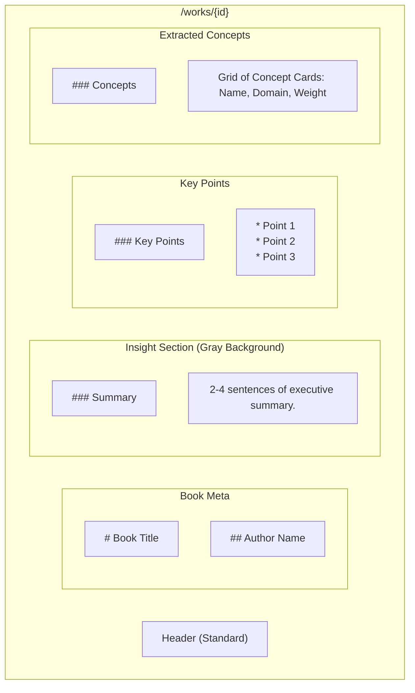

# Wireframe: Book Detail

Detailed insights extracted for a specific work.

## Layout

## Styling

### Summary Box
- **Background:** `#f9f9f9`.
- **Border-left:** 4px solid `#1c69d4`.
- **Padding:** 24px (`space-6`).

### Concept Cards (Mini)
- **Border:** 1px solid `#e5e5e5`.
- **Padding:** 12px.
- **Content:**
    - Name (Inter Bold)
    - Domain (Small text, colored)
    - Relevance Bar (Horizontal bar showing 0.0 to 1.0 strength)
