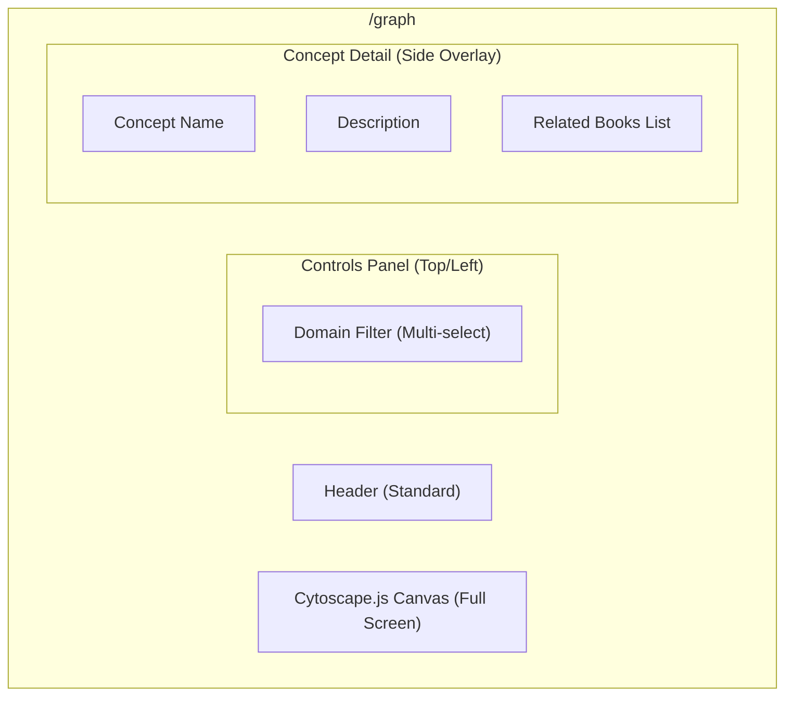

# Wireframe: Concept Graph

Interactive visualization of relationships between extracted concepts.

## Layout

## Interaction Details

### Graph Canvas
- **Engine:** Cytoscape.js.
- **Edges:** Orthogonal (`curve-style: taxi`).
- **Nodes:** Rectangular (`shape: rectangle`), color-coded by domain.
- **Zoom/Pan:** Standard mouse/touch controls.
- **Hover Node:** Highlight node and connected edges. Show name if zoomed out.
- **Selected Node:** `color-brand-blue` (`#1c69d4`) border (2px), persists until another node is clicked or canvas is clicked.
- **Hover Edge:** Show relation type (e.g., "extends") and strength (0.0 - 1.0).

### Domain Filter
- **Type:** Horizontal bar or side drawer.
- **Behavior:** Multi-select chips or checkboxes.
- **Dynamic:** Populated from `SELECT DISTINCT domain FROM concept`.

### Concept Detail (Side Panel)
- **Trigger:** Click on a node.
- **Animation:** Slides in from the right.
- **Content:**
    - Title (Inter Bold)
    - Domain Badge
    - One-sentence definition
    - "Mentioned in:" list of books (Title, Author) - links to `/works/{id}`
    - "Related Concepts:" list (links to other nodes in graph)
