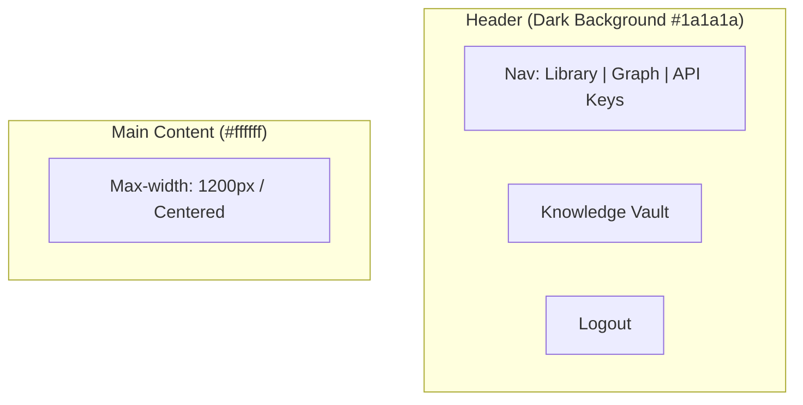

# Global Layout

The application uses a consistent header for navigation and a centered container for content (except for the Graph page).

## Desktop Layout

## Elements

### Header
- **Background:** `#1a1a1a`
- **Text Color:** White
- **Height:** 64px
- **Logo:** "Knowledge Vault" on the left, Inter Bold.
- **Nav Links:** Centered or grouped right. BMW Blue active state.

### Footer
- **Background:** `#ffffff`
- **Content:** "Powered by Open Library & Gemini". Credits mandatory per FR-11.
