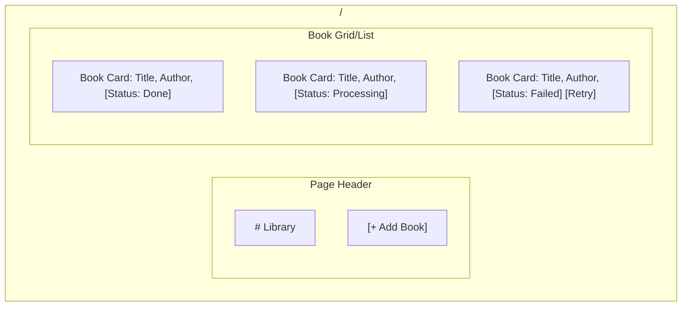

# Wireframe: Library Page

The root page (`/`) shows the list of books and their processing status.

## Layout

## Component Details

### Add Book Button
- **Type:** Primary Button (BMW Blue background, White text).
- **Position:** Top right of the content area.
- **Action:** Opens an inline form or modal.

### Book Card
- **Border:** 1px solid `#e5e5e5`.
- **Corners:** 0px.
- **Padding:** 16px (`space-4`).
- **Interaction:** Hovering changes background to light gray; clicking navigates to `/works/{id}`.
- **Status Badges:**
    - `Pending`: Yellow background (`#ffc107`).
    - `Processing`: Blue background (`#1c69d4`), potentially an animated pulse.
    - `Done`: Green background (`#28a745`).
    - `Failed`: Red background (`#dc3545`). Shows "Retry" button.

### Submit Form (Inline/Modal)
- **Input:** "ISBN or Title".
- **Validation:** Show red border and text if ISBN is invalid.
- **Button:** "Submit" (BMW Blue).
